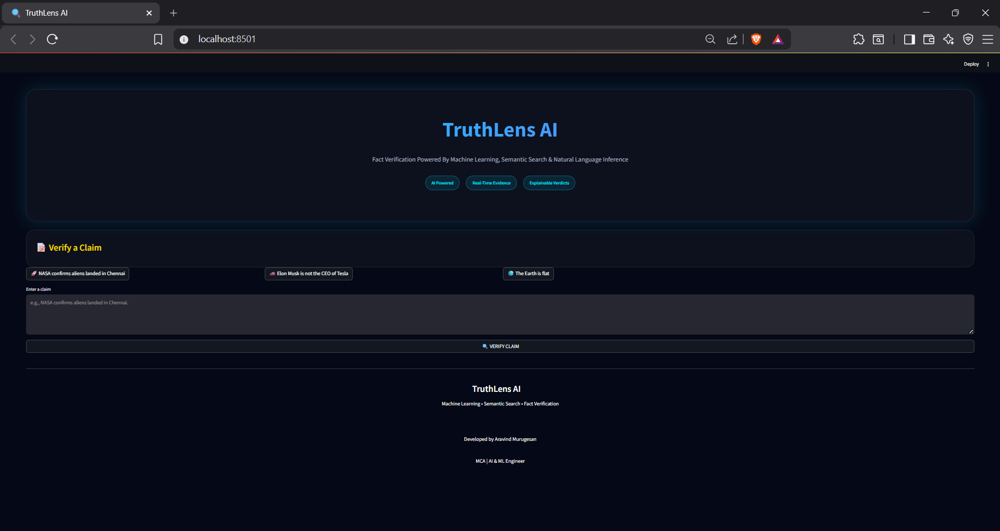
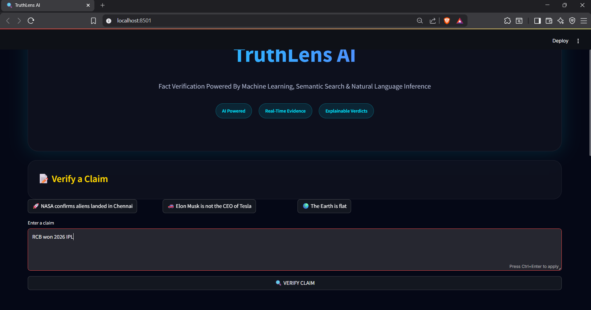
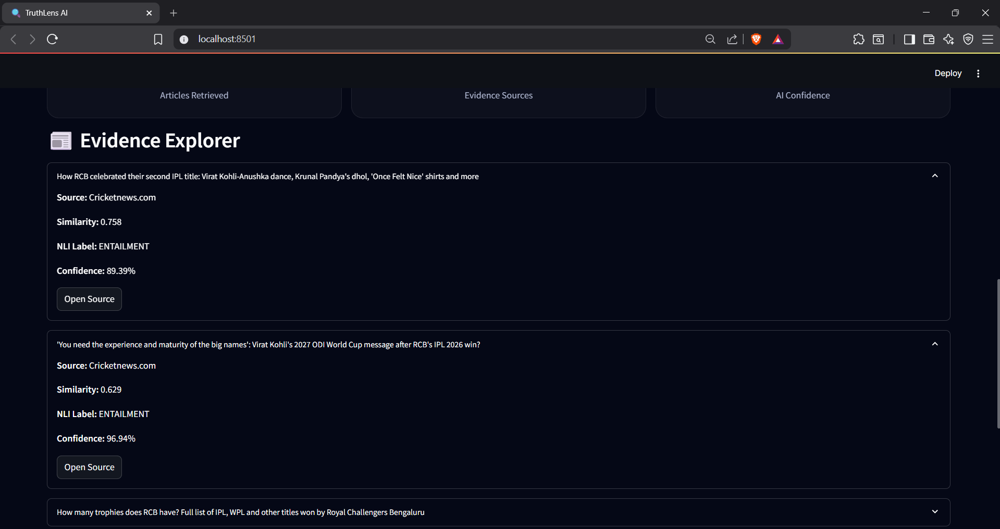
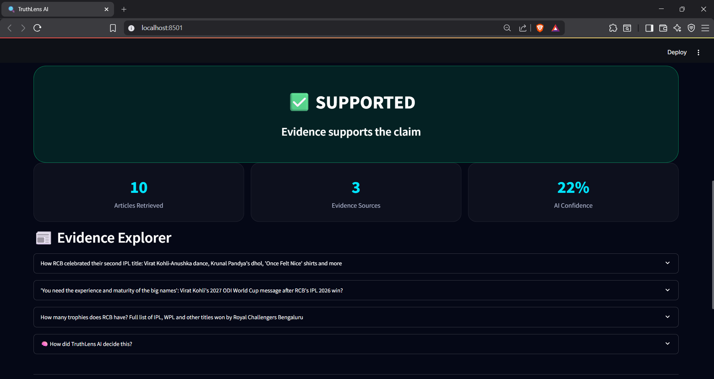

# 🔍 TruthLens AI

### Beyond Detection. Towards Verification.

TruthLens AI is an AI-powered fact verification system that combines historical fake news detection with real-time evidence retrieval and Natural Language Inference (NLI) to verify user claims.

Unlike traditional fake news classifiers that only predict whether a claim looks fake or real, TruthLens AI retrieves external evidence, ranks relevant articles, and determines whether the evidence supports, contradicts, or is insufficient to verify the claim.

---
## Dataset

The dataset used for training the machine learning model is not included in this repository due to GitHub file size limitations.

### Dataset Information

* Type: Fake News Detection Dataset
* Size: ~119 MB
* Format: CSV
* Purpose: Training the TF-IDF + Logistic Regression classifier

### Accessing the Dataset

To run the project locally, place the dataset file inside the `data/` directory:

```text
TruthLens-AI/
│
├── data/
│   └── dataset.csv
```

### Note

The trained model (`logistic_model.pkl`) and vectorizer (`tfidf_vectorizer.pkl`) are already included in this repository, so retraining is not required to use the application.


## 🚀 Features

✅ Historical Fake News Detection using TF-IDF + Logistic Regression

✅ Real-Time News Retrieval using NewsAPI

✅ Hybrid Retrieval Strategy (Claim Search + Query Generation)

✅ Semantic Article Ranking using Sentence-BERT (SBERT)

✅ Evidence Verification using DeBERTa NLI

✅ Explainable Fact-Checking Pipeline

✅ Modern Streamlit Dashboard with Glassmorphism UI

---

## 🏗️ System Architecture

```text
User Claim
    │
    ▼
Historical Detection
(TF-IDF + Logistic Regression)
    │
    ▼
Hybrid Retrieval Layer
(Claim Search + Query Generation)
    │
    ▼
NewsAPI Retrieval
    │
    ▼
SBERT Semantic Ranking
    │
    ▼
DeBERTa NLI Verification
    │
    ▼
Final Verdict
(Supported / Refuted / Insufficient Evidence)
```

---

## 🧠 Tech Stack

### Machine Learning

* Scikit-Learn
* Logistic Regression
* TF-IDF Vectorization

### Natural Language Processing

* SpaCy
* Sentence Transformers (SBERT)
* Hugging Face Transformers
* DeBERTa-v3

### Frontend

* Streamlit
* HTML
* CSS

### APIs

* NewsAPI

---

## 📸 Screenshots

### Home Page

> Add screenshot here

```markdown

```

### Verification Results

> Add screenshot here

```markdown

```

### Evidence Explorer

> Add screenshot here

```markdown

```

---

## 📊 Example

### Claim

```text
NASA confirms aliens landed in Chennai.
```

### Output

```text
Verdict:
INSUFFICIENT EVIDENCE

Articles Retrieved:
0

Reason:
No credible evidence found from trusted news sources.
```

---

## ⚙️ Installation

### Clone Repository

```bash
git clone https://github.com/yourusername/truthlens-ai.git

cd truthlens-ai
```

### Install Dependencies

```bash
pip install -r requirements.txt
```

### Run Application

```bash
streamlit run app.py
```

---

## 📂 Project Structure

```text
truthlens-ai/
│
├── app.py
├── models/
│   ├── logistic_model.pkl
│   └── tfidf_vectorizer.pkl
│
├── screenshots/
│
├── requirements.txt
├── README.md
└── .streamlit/
```

---

## 🔍 Challenges Faced

### 1. Query Generation

Initially, the query generator extracted only named entities.

Example:

```text
NASA confirms aliens landed in Chennai

↓
NASA Chennai
```

Important context was lost.

Solution:

Hybrid retrieval and improved keyword extraction.

---

### 2. Retrieval Quality

Some claims retrieved semantically related but incorrect articles.

Example:

```text
WHO declared COVID-19 a pandemic
```

retrieved Ebola-related articles.

Solution:

Implemented hybrid retrieval and evidence filtering.

---

### 3. Evidence Verification

Different evidence sources could support or contradict claims.

Solution:

Used DeBERTa-based Natural Language Inference to determine:

* Entailment
* Contradiction
* Neutral

---
# TruthLens AI


## Homepage



---

## Claim Verification



---

## Evidence Retrieval



---

## Final Verdict



## 📈 Future Improvements

* Google News Integration
* Tavily Search API
* Multi-source Evidence Aggregation
* Multilingual Fact Checking
* Browser Extension
* Social Media Fact Verification

---

## 🎯 Key Learnings

This project provided practical experience in:

* Machine Learning
* NLP
* Semantic Search
* Retrieval-Augmented Systems
* Fact Verification
* Model Deployment
* End-to-End AI Product Development

---

## 👨‍💻 Author

**Aravind Murugesan**

MCA Student | Machine Learning Engineer Aspirant

University of Madras

---

## ⭐ If you found this project interesting, consider giving it a star!
